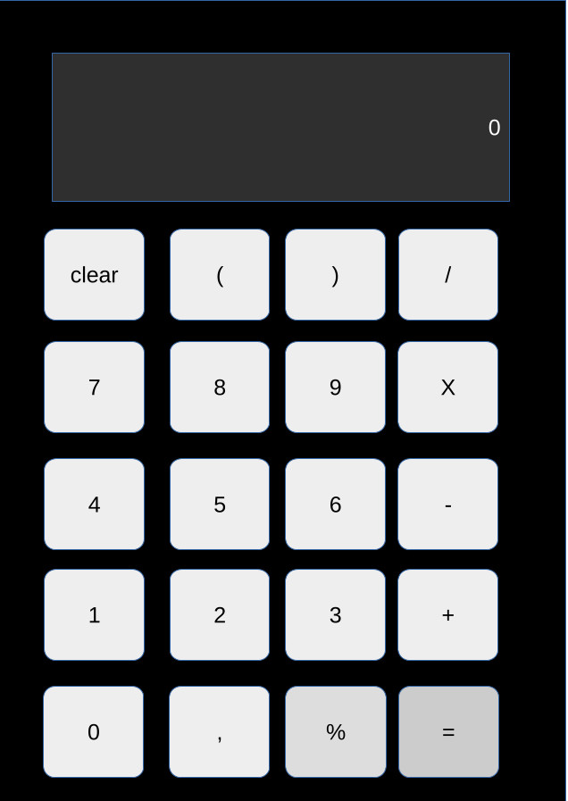

# CALCULADORA EM PYTHON USANDO PYSIMPLEGUI

## Instalação e documentação do pysimplegui
[https://www.pysimplegui.org/en/latest/](https://www.pysimplegui.org/en/latest/)

## Assista a criação da Calculadora em nosso canal do youtube
[https://youtu.be/Gy-Bw6jY6a0](https://youtu.be/Gy-Bw6jY6a0)

## Não esqueça da gente
Esta calculadora foi criada por [https://github.com/elizeubarbosaabreu](Elizeu barbosa Abreu)